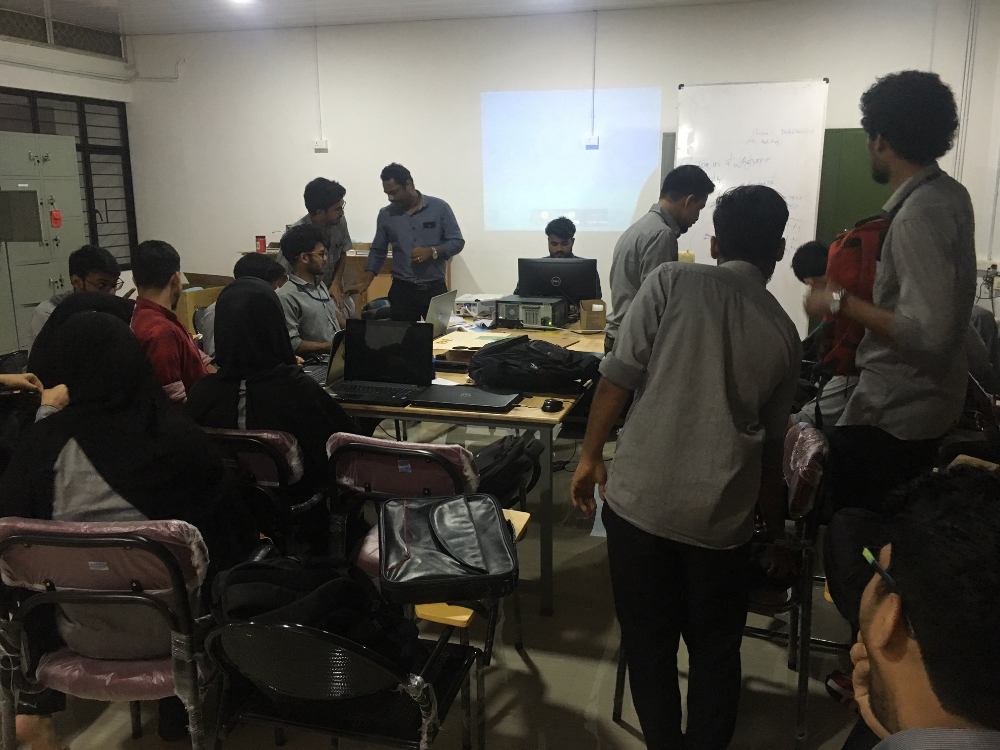
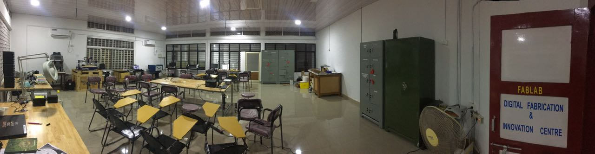
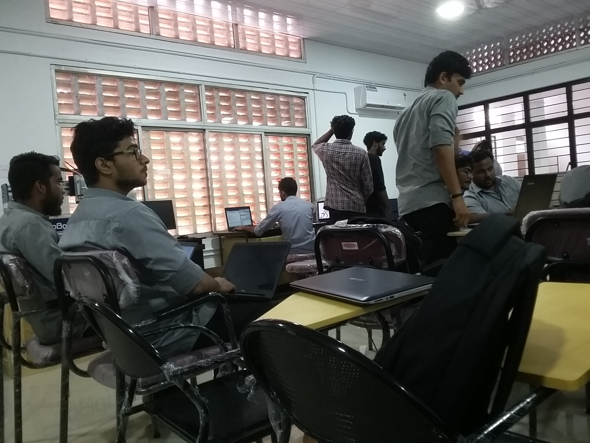
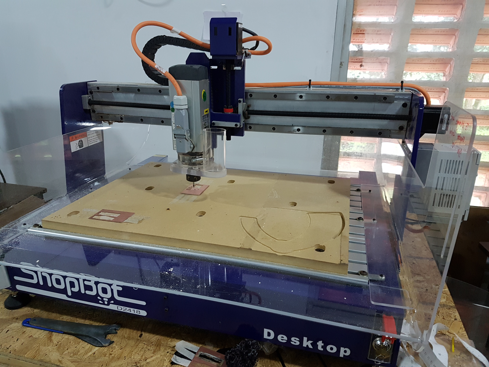
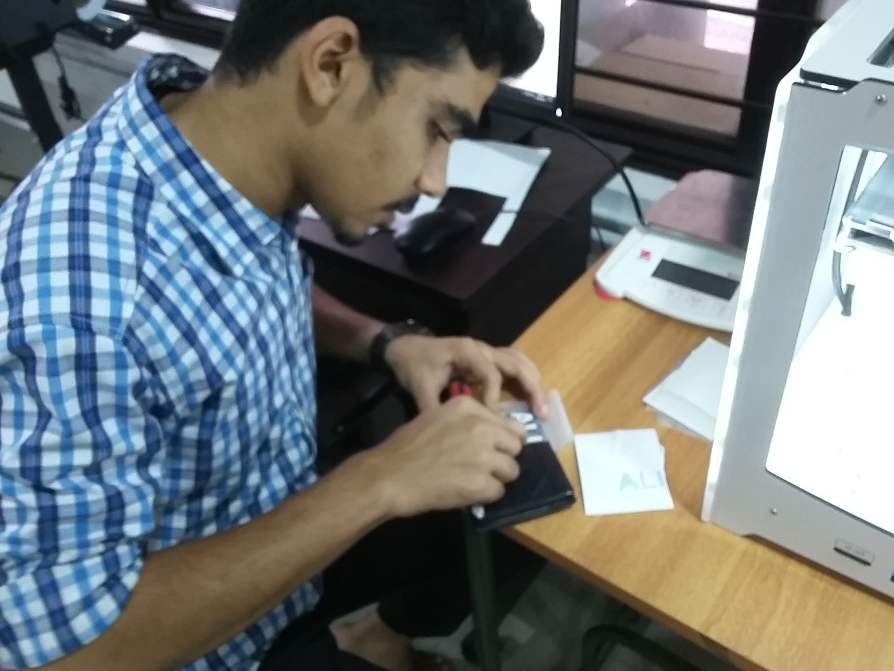
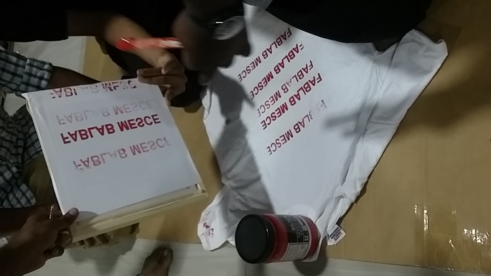
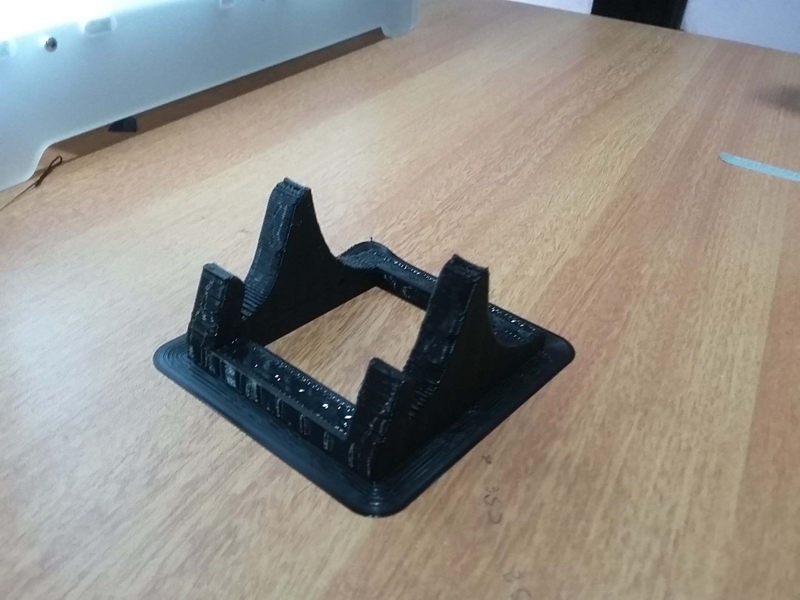
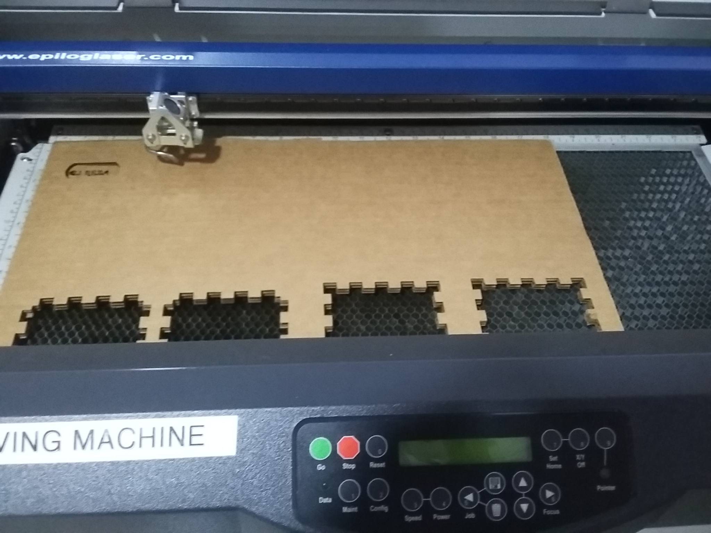
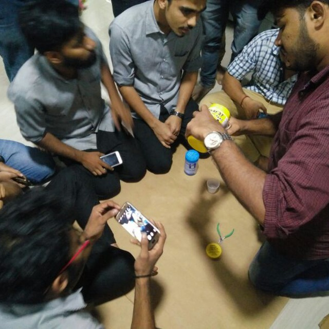

## ALI REZA NV

# About me

I'm Reza. Civil engineering pursuing student in MESCE
Intrested in digital fabrications..

## contact me
+91 8129198458

[follow me on fb ](https://www.facebook.com)

Batch A 

# Day 1 : Introduction to Fablab 
"FabLab - MESCE” is digital manufacturing technology, combininig 2D and 3D design with the latest fabrication technology. Embracing a broad spectrum of methods ranging from CNC machining to 3D printing, and even PCB Milling. It can produce a single unique product from a digital design in a matter of minutes- and at a very low cost in comparison to traditional tooling methods.

HOW TO MAKE ALMOST ANYTHING..

We got an overview of how the seven days were going to be spent at FABLAB. We went through and just got introduced to all the machines we were going to use and play with. So, today we entered the magical world and were all set to explore more .

# Day 2 : Github Pages and Documentation
                               
   https://alirezanv.github.io/                            
   
   Today we learnt how we could document our work and experiences through github pages and how we could essentially use them in the future. The documenting actually feels amazing. It is like writing memories that wouldn’t fade with time. On a serious note, one can always record such experiences and learning and also share. I think everyone must make it a habit to document whenever we learn a new thing so that it does not get erased even if we forget.

Maintaining github pages is pretty simple. All you have to do is to follow a few simple steps and you can share you’re own online document to anyone anywhere. Sounds awesome , doesnn’t it..

STEPS

-Create an account in github.just click on the link given

-Create your project’s repository. Login to your GitHub account and go to https://github.com/new or click the New repository icon from your account homepage.
-Name your repository username.github.io, replacing username with your GitHub username. Be sure it is public and go ahead and tell GitHub to create a README/index.md file upon generating the repo.

  Now that your repository is ready. Create a readme/index.md file .
  
  https://github.com/alirezanv/alirezanv.github.io/edit/master/index.md
  
  
Now you are ready to go. Open the file and edit it using markdown, html or anything of your choice. You can follow this link if you need help https://guides.github.com/features/mastering-markdown/

# Day 3: Electronics Production and CNC

CNC
Computer numerical control (CNC) is the automation of machine tools by means of computers executing pre-programmed sequences of machine control commands.This is in contrast to machines that are manually controlled by hand wheels or levers, or mechanically automated by cams alone

      
Our aim in this section was to complete PCB milling and cutting and also to solder the PCB. Unfortunately we couln’t accomplish this due to technical crisis as im an civil engineering student
                               
                               
# DAY 4 : Vinyl Cutting
A vinyl cutter is a type of computer-controlled machine. Small vinyl cutters look like computer printers. The computer controls the movement of a sharp blade. This blade is used to cut out shapes and letters from sheets of thin self-adhesive plastic (vinyl).

So, you could say vinyl cutting can be used to make your own customised stickers etc..It is fun to work with. We can just design anything and then cut it using the software
CutShop
      
  STEPS

Create your design using any software of your choice or choose one from any browser and open the file using the CutShop software. The image must be preferably gray scale to get the accurate design.
Right click and select trace the image outline. Change the settings as required and press enter key.
Now you can adjust the size of vinyl to be used : Right click on the image and select Properties. ( The size is in mm .)
Your design is ready to be cut. 

# DAY 5 : Screen Printing

We created a mirror sticker of "FABLAB MESCE" in vinyl cutting machine. 
-Then sticked it to screen printing wooden frame.
-Then the red colour is applied to it
-The T-shirt is cleaned for applying print
-The frame is kept firmly on the T-shirt 
-Then the colour is applied on T-shirt by applying to&fro action of other piece of tool
-After kept to sunlight. It became sticken

# DAY 6 : 3D Printing
The term “3D printing” originally referred to a process that deposits a binder material onto a powder bed with inkjet printer heads layer by layer. More recently, the term is being used in popular vernacular to encompass a wider variety of additive manufacturing techniques. United States and global technical standards use the official term additive manufacturing for this broader sense. ISO/ASTM52900-15 defines seven categories of AM processes within its meaning: binder jetting, directed energy deposition, material extrusion, material jetting, powder bed fusion, sheet lamination and vat photopolymerization.

                                
# Day 7 : Laser Cutting,Moulding and Casting

Laser Cutter can used for two functions

Cutting

Engraving

I started with Laser Cutter , I was thinking about to design a keychain with my name on it , and I choose my picture to engarve that on a carboard. there are two types of functions by using a laser cutter, they are cutting and engraving. the function determined by system configuration such as power , speed and image type whether it is rastor or vector.

# Moulding and Casting
Casting is a manufacturing process in which a molten material is introduced into a solid mold and allowed to solidify. The solid material takes the shape of the mold. The term usually refers to metals but can also apply to the same process for other materials. Ceramics can be “slip cast” and polymers can also be cast. Molding refers to shaping a material that is soft but not fully liquid. (Think wet clay, for instance) Molding as a process might also use a mold to shape the soft material, but doesn’t necessarily require one.

Project

Nowadays it is more required of mobile holders

                                
